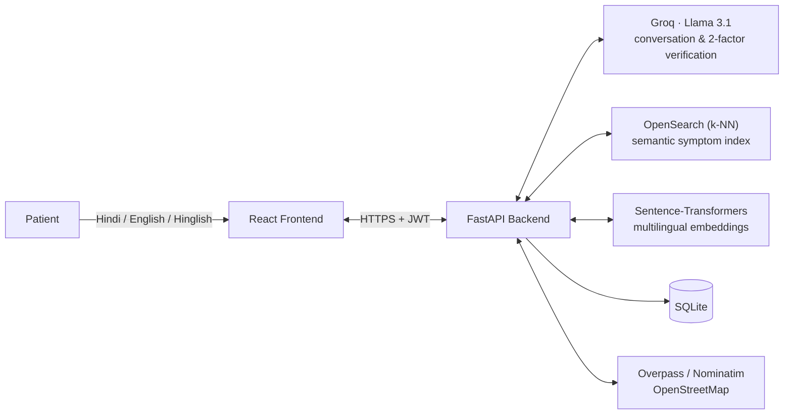

# Sahaayak AI

An AI triage assistant that meets patients in whatever language they actually speak — Hindi, English, or the Hinglish in between.

[](https://www.python.org/)
[](https://react.dev/)
[](https://fastapi.tiangolo.com/)
[](https://opensearch.org/)
[](LICENSE)

## The Problem

Rural India's healthcare gap isn't only a shortage of doctors — it's also a shortage of systems that can hear patients on their own terms. Symptom descriptions rarely arrive in tidy clinical English; they arrive as a mix of Hindi and English, shaped by how people actually talk. Most triage tools aren't built for that, so patients either simplify what they're feeling to fit the tool, or skip it entirely.

Sahaayak AI is built around the opposite assumption: meet the patient in their own words, and do the normalization in the backend, not in the patient's head.

## A Sample Conversation

```text
Patient:  mujhe 3 din se bukhar hai aur badan mein bahut dard hai
Sahaayak: Got it — fever for 3 days with body ache. A couple of quick questions:
          • Any chills, sweating, or cough along with it?
          • Is the fever constant, or does it spike at certain times of day?

Patient:  thoda cough bhi hai, aur fever raat ko zyada badh jata hai

Sahaayak: → Urgency: Medium
          → Suggested specialist: General Physician
          → Home care: fluids, rest, paracetamol per standard OTC dosing
          → Flagged: seek in-person care if fever crosses 103°F or persists past 5 days
```

Everything after the conversation — the urgency score, the specialist match, the home-care note — is generated by the pipeline described below, not hand-scripted.

## How it Fits Together



A few of the choices behind this shape, and why:

- **OpenSearch (k-NN) & Sentence-Transformers** handle the core medical retrieval. Instead of basic keyword matching, we embed patient symptoms into high-dimensional vectors and perform semantic search against a verified symptom-disease index.
- **Groq (Llama 3.1) handles the open-ended part & acts as a sanity-checker.** It manages the free-form, multilingual symptom conversation, extracts the core symptoms, and does a final 2-factor verification on the diagnosis retrieved from OpenSearch.
- **SQLite** keeps the deployment self-contained — no external database to provision, which matters for a system aimed at low-infrastructure environments.
- **OpenStreetMap (Overpass + Nominatim)** powers hospital lookup instead of a paid places API, keeping the running cost at zero.

## What it Does

**Understands the patient, not just the transcript.** Follows natural Hindi, English, and Hinglish conversation without asking patients to translate themselves into clinical English first.

**Triages by urgency.** Every consultation resolves to a Low / Medium / High / Critical rating.

**Routes to the right specialist.** Maps reported symptoms to the specialist that's actually relevant, not a generic "see a doctor."

**Flags critical cases immediately.** High-risk conditions surface front and center, not buried in a report.

**Stays within its lane.** Suggestions are limited to general OTC and home-care guidance — never prescription dosages.

**Remembers every consultation.** Transcript, vitals, and outcome are persisted per report, not thrown away after the session.

**Finds care nearby.** Location-based hospital search with phone numbers, built entirely on free OpenStreetMap data.

**Speaks two languages at the UI level too.** Full English / हिन्दी interface toggle, not just in the chat.

**Works on whatever's on hand.** Responsive across desktop, tablet, and phone.

## Stack

| Component | Technology |
|---|---|
| **Frontend** | React 18, React Router, Axios, jsPDF, lucide-react |
| **Backend** | FastAPI, Uvicorn, Pydantic |
| **Conversation & AI** | Groq (Llama 3.1) |
| **Search & Retrieval** | OpenSearch (k-NN), HuggingFace Sentence-Transformers |
| **Auth** | JWT, PBKDF2-SHA256 password hashing |
| **Database** | SQLite |
| **Hospital Data** | OpenStreetMap (Overpass API + Nominatim) |

## Running it Locally

**Prerequisites:** Python 3.10+, Node.js 18+, Docker (for OpenSearch), and a free [Groq API key](https://console.groq.com).

```bash
git clone [https://github.com/vickbhor/Sahaayak.git](https://github.com/vickbhor/Sahaayak.git)
cd Sahaayak
```

**Step 1: Start OpenSearch (Vector DB)**
```bash
# In the directory containing docker-compose.yml
docker compose up -d
```

**Step 2: Backend Setup**
```bash
cd backend
python -m venv venv
venv\Scripts\activate        # Windows
source venv/bin/activate     # macOS/Linux
pip install -r requirements.txt
```

Add a `.env` file in `backend/` (see `.env.example`) with your `GROQ_API_KEY`, then build the semantic index:

```bash
# This downloads the embedding model and populates OpenSearch
python build_semantic_index.py 

# Start the server
python app.py
```
Serves at `http://localhost:8000`; interactive docs at `/docs`.

**Step 3: Frontend Setup**
```bash
cd ../frontend
npm install
npm start
```
Runs at `http://localhost:3000`.

## Repository Layout

```text
Sahaayak/
├── backend/
│   ├── app.py                      FastAPI routes
│   ├── auth.py                     JWT + password hashing
│   ├── database.py                 SQLite models & queries
│   ├── semantic_classifier.py      OpenSearch & vector retrieval logic
│   ├── embedder.py                 Multilingual embedding generation
│   ├── build_semantic_index.py     Script to populate the vector database
│   ├── groq_helpers.py             Conversation & secondary verification
│   ├── hospitals.py                OpenStreetMap hospital search
│   ├── docker-compose.yml          OpenSearch container config
│   └── requirements.txt
└── frontend/
    └── src/
        ├── pages/                  Landing, Login, Signup, Dashboard, Consultation
        ├── components/             Sidebar, VitalsIntake, TriageDemoPanel
        ├── context/                AuthContext, LanguageContext
        └── i18n/                   English / Hindi translations
```

## API Surface

**Auth**

| Method | Endpoint | Description |
|---|---|---|
| POST | `/api/auth/register` | Create an account |
| POST | `/api/auth/login` | Log in, returns a JWT |
| GET | `/api/auth/me` | Current user info |

**Triage & Reports**

| Method | Endpoint | Description |
|---|---|---|
| POST | `/api/triage` | Send a chat message or generate a report |
| GET | `/api/reports` | List all saved reports |
| GET | `/api/reports/{id}` | Full report detail |
| GET | `/api/medications` | All AI-suggested medicines across reports |

**Hospitals**

| Method | Endpoint | Description |
|---|---|---|
| GET | `/api/hospitals/nearby?lat=&lon=` | Hospitals near coordinates |
| GET | `/api/hospitals/search?query=` | Hospitals near a city or pincode |

## What's Next

- Voice input, for low-literacy users
- SMS fallback, for feature phones
- A doctor-facing dashboard for flagged critical cases
- Regional languages beyond Hindi

## Limitations

Sahaayak AI provides AI-assisted guidance and does not replace professional medical diagnosis. In a medical emergency, contact local emergency services immediately.

## License

MIT — see [LICENSE](LICENSE).
