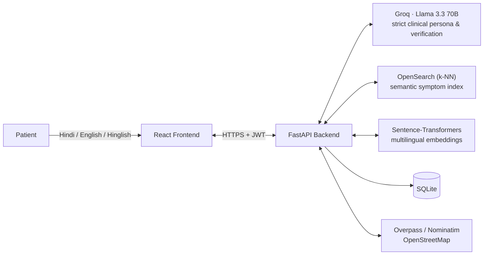

# 🩺 Sahaayak AI

> **An intelligent triage assistant designed to meet patients in the language they actually speak — Hindi, English, or the Hinglish in between.**

---

## 💡 The Problem & Our Approach

Rural and semi-urban healthcare gaps aren't solely caused by a shortage of medical professionals — they are deeply exacerbated by a lack of accessible triage systems that understand patients on their own terms.

When patients describe symptoms, they rarely use tidy, clinical English. Their descriptions are raw, conversational, and often a fluid mix of Hindi and English. Most existing digital triage tools force the user to translate their discomfort into rigid medical terminology. As a result, patients either oversimplify their conditions, misreport symptoms, or abandon the tool entirely.

**Sahaayak AI flips this model.**
Built with a user-centric design approach, Sahaayak assumes the burden of translation. It allows the patient to explain their problem in their natural dialect and handles the complex medical normalization, semantic mapping, and triage scaling entirely in the backend.

---

## ✨ Key Features

* **🗣️ True Multilingual Understanding:** Follows natural Hindi, English, and Hinglish conversations seamlessly. No need for the patient to act as their own translator.
* **🚦 Intelligent Urgency Triage:** Automatically classifies every consultation into distinct severity levels: *Low, Medium, High, or Critical*.
* **🩺 Smart Specialist Routing:** Maps reported symptoms to the most relevant medical specialist, avoiding generic "see a doctor" advice.
* **❤️ Strict Clinical Persona:** Enforces a mandatory empathy-first rule. The AI interacts with the maturity of a seasoned doctor, asking only one highly relevant follow-up question at a time to prevent patient fatigue.
* **🚨 Real-Time Emergency Flagging:** Scans active conversations for critical keywords (e.g., chest pain, severe weakness) and immediately halts the chat to issue emergency medical warnings before report generation.
* **🔍 AI Trust Layer & Clinical Rationale:** Fully transparent diagnostic reports featuring an expandable clinical reasoning accordion and explicit confidence score metrics.
* **💊 Safe & Guardrailed Advice:** Strictly limits suggestions to general OTC (Over-The-Counter) and home-care guidance. The AI is hardcoded to *never* prescribe exact medical dosages.
* **🏥 Zero-Cost Hospital Locator:** Integrates free OpenStreetMap data to provide location-based hospital searches, complete with contact details, keeping infrastructure costs at zero.
* **📱 Fully Responsive UI:** Accessible across desktop, tablet, and mobile devices with a full English/हिन्दी interface toggle.
* **💾 Persistent Consultation History:** Safely stores chat transcripts, patient vitals, and final triage outcomes for future reference.

---

## 💬 A Sample Conversation

```
Patient:  mujhe 3 din se bukhar hai aur badan mein bahut dard hai

Sahaayak: Mujhe sunkar dukh hua ki aapko takleef ho rahi hai. Ye bukhar lagatar rehta hai, ya din ke kisi khaas waqt zyada badh jata hai?

Patient:  thoda cough bhi hai, aur fever raat ko zyada badh jata hai

Sahaayak: → Urgency: Medium
          → Suggested specialist: General Physician
          → Home care: fluids, rest, paracetamol per standard OTC dosing
          → Flagged: seek in-person care if fever crosses 103°F or persists past 5 days
```

*Note: Everything following the conversation—the urgency score, specialist match, and care notes—is dynamically generated by our robust backend pipeline, not hardcoded scripts.*

---

## 🏗️ System Architecture


```mermaid
flowchart LR
    U[Patient] -->|Hindi / English / Hinglish| FE[React Frontend]
    FE <-->|HTTPS + JWT| BE[FastAPI Backend]
    BE <--> LLM["Groq · Llama 3.3 70B<br/>strict clinical persona & verification"]
    BE <--> VDB["OpenSearch (k-NN)<br/>semantic symptom index"]
    BE <--> EMB["Sentence-Transformers<br/>multilingual embeddings"]
    BE --> DB[(SQLite)]
    BE <--> OSM["Overpass / Nominatim<br/>OpenStreetMap"]
```

### Why this architecture?

1. **OpenSearch (k-NN) & Sentence-Transformers:** Handles core medical retrieval. Instead of relying on fragile keyword matching, patient symptoms are converted into high-dimensional vectors. We then perform a semantic search against a medically verified symptom-disease index.
2. **Groq (Llama 3.3 70B):** Acts as the conversational engine and a rigorous sanity-checker. The massive 70B parameter model perfectly understands complex Hinglish, strictly enforces empathy guardrails, and performs 2-factor verification on OpenSearch diagnoses.
3. **SQLite:** Keeps the deployment lightweight and self-contained. By eliminating the need to provision an external database, the system remains highly viable for low-infrastructure environments.
4. **OpenStreetMap (Overpass + Nominatim):** Powers the nearby hospital lookup without the recurring costs of premium Places APIs.

---

## 🛠️ Technology Stack

| Domain | Technology / Tool |
| --- | --- |
| **Frontend** | React 19, React Router, Axios, jsPDF, lucide-react |
| **Backend** | FastAPI, Uvicorn, Pydantic, email-validator |
| **AI & LLM** | Groq (Llama 3.3 70B Versatile) |
| **Search & Retrieval** | OpenSearch (k-NN), HuggingFace Sentence-Transformers |
| **Authentication** | JWT, PBKDF2-SHA256 password hashing |
| **Database** | SQLite |
| **Geospatial Data** | OpenStreetMap (Overpass API + Nominatim) |

---

## 📊 Model Evaluation & Tuning

The k-NN symptom classifier is evaluated automatically every time the index is built — there's no separate step to remember.

Running `build_semantic_index.py` reports:

* **70:30 split accuracy** and **untouched holdout accuracy** — standard generalization checks.
* **Per-class precision / recall / F1** on the 70:30 split, printed to console and saved in `semantic_eval_results.json`. Raw accuracy alone can hide class imbalance — several CRITICAL-urgency diseases (Heart Attack, AIDS, Paralysis) have far fewer training examples than common ones, so this breaks the aggregate number down by disease instead of relying on one blended figure.
* **Paraphrase accuracy** — 41 hand-written, differently-worded symptom descriptions, one per disease class (up from an earlier 12-case set covering only a third of the classes), that never appear in training data. Used to sanity-check that the model generalizes to real-world phrasing rather than memorizing exact wording, and now gives full-coverage, per-class signal instead of a small sample with a wide confidence interval.
* **K-sweep comparison** — the same index is queried at `K = 3, 5, 7, 9` (in addition to whatever `SEMANTIC_K` is set to) so you can see which K value gives the best paraphrase accuracy *without re-embedding or re-indexing*, since K is a query-time parameter only. Pick the best-performing K and set it permanently via `SEMANTIC_K` in `.env`.

This run is deterministic (fixed `random_state` for the train/test split) and safe to re-run as many times as needed — it overwrites `semantic_eval_results.json` and the OpenSearch index in place rather than accumulating files or duplicate indices.

**End-to-end pipeline evaluation:** the eval above only measures the raw k-NN retrieval layer. To evaluate the *full* pipeline — retrieval + Groq LLM verification + red-flag escalation, i.e. exactly what a live request goes through — run:

```bash
python evaluate_end_to_end.py
```

after `build_semantic_index.py` (it reuses the already-built index and the same held-out rows). This requires `GROQ_API_KEY` to be set, since it makes real verification calls. It reports end-to-end accuracy on all three eval sets plus a **verification override rate** — how often the Groq step actually changed the retrieval layer's top prediction — and writes `end_to_end_eval_results.json`. `view_metrics.py` will pick this file up automatically if it exists alongside `semantic_eval_results.json`.

**Known limitation:** a handful of diseases with genuinely overlapping symptom profiles (e.g. Typhoid vs. Malaria, Bronchial Asthma vs. Heart Attack, Jaundice vs. Hepatitis B) are harder to separate on symptom text alone and are documented as an open limitation rather than papered over.

> **💡 Key Finding:** Our end-to-end evaluation revealed that while secondary LLM verification acts as a powerful restorative filter for noisy, real-world vernacular queries, it can aggressively over-correct standard clinical data. This empirical insight directly drives Sahaayak's strict confidence-gated architecture.

---

## 🚀 Running it Locally

### Prerequisites

Before you begin, ensure you have the following installed:

* **Python 3.10+**
* **Node.js 18+**
* **Docker** (Required for running OpenSearch)
* A free **[Groq API key](https://console.groq.com)**

### Step-by-Step Setup

**1. Clone the Repository**

```bash
git clone https://github.com/vickbhor/Sahaayak.git
cd Sahaayak
```

**2. Start OpenSearch (Vector Database)**

```bash
# Navigate to the semantic scripts directory
cd sementic/scripts
docker compose up -d
```

**3. Backend Configuration & Model Training**

```bash
# Open a new terminal and setup Python Virtual Environment
cd backend
python -m venv venv

# Activate Virtual Environment
venv\Scripts\activate        # For Windows
source venv/bin/activate     # For macOS/Linux

# Install Dependencies
pip install -r requirements.txt
```

* Copy `.env.example` to `.env` in the `backend/` directory and fill in your own `GROQ_API_KEY`, `JWT_SECRET`, and OpenSearch credentials. **Never commit `.env` itself** — it's already covered by `.gitignore`; only `.env.example` (with blank values) should be tracked in git.
* **Build the Semantic Index:** Navigate to the scripts folder to train the model and populate OpenSearch.

```bash
cd ../sementic/scripts
python build_semantic_index.py
```

  This single command builds the index **and** prints the full evaluation report described above (split/holdout/paraphrase accuracy + K-sweep table) — no separate step needed.

* **📊 View AI Performance Metrics (Optional but highly recommended!):**
  Want to revisit the accuracy report without rebuilding the index? Run:

```bash
python view_metrics.py
```

* **Start the FastAPI server:**

```bash
cd ../../backend
python app.py
```

> **Note:** The backend serves at `http://localhost:8000`. Interactive API documentation (Swagger UI) is available at `/docs`.

**4. Frontend Configuration**

```bash
cd ../frontend
npm install
npm start
```

> **Note:** The frontend application will run on `http://localhost:3000`.

---

## 📂 Repository Layout

```
Sahaayak/
├── backend/
│   ├── app.py                     # Core FastAPI routes & endpoints
│   ├── auth.py                    # JWT generation & password hashing
│   ├── database.py                # SQLite models & ORM queries
│   ├── semantic_classifier.py     # OpenSearch & vector retrieval logic
│   ├── groq_helpers.py            # Conversation, reasoning extractor & verification
│   ├── hospitals.py               # OpenStreetMap hospital search integration
│   ├── models/                    # ML model artifacts (hingrobert_model)
│   ├── .env.example               # Environment variables template (no real secrets — copy to .env and fill in)
│   ├── SETUP.md                   # Detailed setup instructions
│   └── requirements.txt           # Python dependencies (incl. email-validator)
├── sementic/
│   └── scripts/
│       ├── build_semantic_index.py    # Builds the vector index + prints accuracy/per-class/K-sweep report
│       ├── evaluate_end_to_end.py     # Evaluates the full pipeline (retrieval + Groq verification + red-flag escalation)
│       ├── view_metrics.py            # Re-displays the last AI accuracy & performance report (retrieval-only + end-to-end, if run)
│       ├── embedder.py                # Multilingual embedding generation
│       ├── docker-compose.yml         # OpenSearch container configuration
│       └── phase1_artifacts/          # Training pool (cv_pool*.csv), holdout set, and disease labels
└── frontend/
    └── src/
        ├── pages/                 # Landing, Login, Signup, Dashboard, Consultation, ReportDetail
        ├── components/            # Sidebar, VitalsIntake, TriageDemoPanel, Logo, LanguageSelect
        ├── context/               # AuthContext, LanguageContext
        └── i18n/                  # English / Hindi localization mappings
```

## 🔌 API Reference

### Authentication

| Method | Endpoint | Description |
| --- | --- | --- |
| `POST` | `/api/auth/register` | Register a new patient account |
| `POST` | `/api/auth/login` | Authenticate and receive a JWT token |
| `GET` | `/api/auth/me` | Retrieve current authenticated user profile |

### Triage & Medical Reports

| Method | Endpoint | Description |
| --- | --- | --- |
| `POST` | `/api/triage` | Submit a chat message or generate a final triage report (returns confidence score, reasoning, and red flags) |
| `GET` | `/api/reports` | Fetch a list of all historical patient reports |
| `GET` | `/api/reports/{id}` | Retrieve deep details of a specific consultation |
| `GET` | `/api/medications` | Aggregate list of AI-suggested OTC medicines across reports |

### Hospital Locator

| Method | Endpoint | Description |
| --- | --- | --- |
| `GET` | `/api/hospitals/nearby?lat=&lon=` | Discover medical facilities near specific coordinates |
| `GET` | `/api/hospitals/search?query=` | Search for hospitals by city name or local pincode |

---

## 🔮 Roadmap & Future Scope

* **🎙️ Voice Input Integration:** To support users with low literacy or limited typing proficiency.
* **📶 SMS Fallback:** Enabling triage capabilities for basic feature phones without internet access.
* **👨‍⚕️ Doctor-Facing Dashboard:** A dedicated portal for healthcare professionals to review flagged critical cases instantly.
* **🌍 Expanded Localization:** Adding support for more regional Indian languages (e.g., Bengali, Marathi, Tamil, Telugu).

---

## ⚠️ Disclaimer & Limitations

**Sahaayak AI is an assistive technology designed to provide preliminary triage guidance. It does NOT replace professional medical diagnosis, advice, or treatment.**

The system provides general insights based on reported symptoms. In the event of a medical emergency, severe pain, or rapidly worsening symptoms, users must contact local emergency services or visit the nearest hospital immediately.

---

## 📄 License

This project is licensed under the MIT License — see the [LICENSE](LICENSE) file for details.